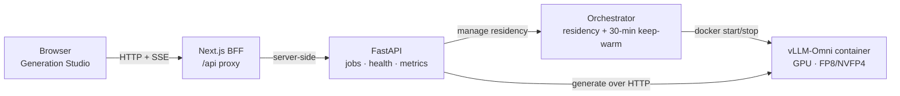

<p align="center">
  
</p>

<p align="center">
  <a href="LICENSE"></a>
  
  
  <a href="https://github.com/fengwang/Cosmos3-Nano-WebUI/actions/workflows/ci.yml"></a>
</p>

<h1 align="center">Cosmos3-Nano-WebUI</h1>

<p align="center">
  <b>Run a world model on your own GPU.</b><br>
  A self-hostable <b>API + Web UI</b> for Cosmos3-Nano: text/image&rarr;video (with
  audio), text&rarr;image, reasoning, and robot action, served locally from quantized
  <b>FP8 / NVFP4</b> checkpoints. No accounts, no API keys, nothing leaves your machine.
</p>

> [!NOTE]
> Built for a **trusted LAN or lab box**: no application login, and ports bind to
> `localhost` by default. Today only **text&rarr;image** is GPU-verified end to end;
> the other modes are implemented and CPU-tested, with GPU validation a manual gate.
> Full posture and per-mode status live in [Status & security](#status--security).

## Quickstart

**TL;DR:** clone, grab a checkpoint, build, run. About five minutes plus the
checkpoint download. Public inputs only, so no accounts and no API keys.

```bash
# 1. Clone
git clone https://github.com/fengwang/Cosmos3-Nano-WebUI.git
cd Cosmos3-Nano-WebUI

# 2. Download a pinned public checkpoint (ungated, no auth). FP8 shown; NVFP4 is analogous.
pip install "huggingface_hub[cli]"
hf download wfen/Cosmos3-Nano-FP8-Blockwise \
  --revision 9bf5d6ae164688487bdb71947ccc6ebe70d12900 \
  --local-dir ./models/Cosmos3-Nano-FP8-Blockwise

# 3. (Optional) configure. The defaults work for a local run.
cp .env.example .env      # edit only for LAN binding or a custom model path

# 4. Build the images (CPU) and bring up the FP8 stack
make build                # builds the api + webui images
make up-fp8               # webui :3000, api :8000, generation container

# 5. Check health, then open the Studio
make health               # GET /v1/health/ready
# → open http://localhost:3000  (you land directly in the Generation Studio)
```

No keys to set. Building the GPU image and running inference is the manual gate
(`MIG-S8`): text&rarr;image is verified end to end, the other modes are not yet.
See [Status & security](#status--security) and
[`docs/model_setup.md`](docs/model_setup.md).

<details>
<summary>Run NVFP4 or add the reasoning stack instead</summary>

- **NVFP4** (more VRAM headroom): download `wfen/Cosmos3-Nano-NVFP4-Blockwise` at
  its pinned revision (see [`docs/model_setup.md`](docs/model_setup.md)), then
  `make up-nvfp4`. Run one stack at a time.
- **Reasoning + action** (adds the BF16 base): `make up-fp8-reasoning`.
</details>

**Jump to:** [What it does](#what-it-does) · [How it works](#how-it-works) ·
[Features](#features) · [Requirements](#requirements) ·
[Checkpoint setup](#checkpoint-setup) · [Troubleshooting](#troubleshooting) ·
[Status & security](#status--security)

## What it does

Cosmos3-Nano-WebUI wraps the Cosmos3-Nano world model behind a clean HTTP API and
a Next.js web app. You run generation and reasoning on your own machine, from
public quantized checkpoints.

It targets a single RTX 5090-class GPU. Weights download from Hugging Face and are
never committed to Git or baked into images. The generation engine runs in its own
container. Open the web app and you land straight in the Generation Studio.

## How it works

A request flows from the browser to a GPU container and back. The API keeps the
model warm between jobs, so a normal watch-think-tweak loop does not pay a cold
reload each time.



The API sends generation requests to the vLLM-Omni container over HTTP. The
orchestrator owns that container's lifecycle over the Docker socket: it starts the
container on demand and evicts it after an idle window to free VRAM (see
[Status & security](#status--security)).

## Features

Every generation, reasoning, and action mode is **implemented and covered by CPU
tests**. Text&rarr;image (FP8 and NVFP4) is GPU-verified end to end. The other GPU
inference paths are a documented manual gate.

| Capability | Endpoint(s) | Status |
|---|---|---|
| Text&rarr;image (FP8, NVFP4) | `POST /v1/generation/t2i` | Implemented · **GPU-verified¹** |
| Text&rarr;video · image&rarr;video · video+audio | `POST /v1/generation/{t2v,i2v,t2v_audio}` | Implemented · CPU-tested · GPU gate¹ |
| Reasoning | `POST /v1/reason` | Implemented · CPU-tested · GPU gate¹ |
| Robot action / forward & inverse dynamics / policy | `POST /v1/action/{forward_dynamics,inverse_dynamics,policy}` | Implemented · CPU-tested · GPU gate¹ |
| Async jobs + live progress over SSE | `POST /v1/jobs`, `GET /v1/jobs/{id}`, `.../events`, `.../artifact`, `.../trajectory`, `.../cancel` | Implemented · CPU-tested |
| Health & Prometheus metrics | `GET /v1/health/{live,ready}`, `GET /v1/metrics` | Implemented · CPU-tested |
| Web UI (generation, history, 3D / robot views) | Next.js 15 + React 19 app | Implemented · CPU-tested |

¹ GPU inference is a manual release gate (`MIG-S8`). Only text&rarr;image is verified
end to end (`GPU-S3`): fresh checkpoint download, from-source image, no manual
workaround. A recommended 720p text&rarr;video smoke has passed on both FP8 and NVFP4,
but that does not by itself promote the video, reasoning, or action modes to
"verified", and no performance numbers are promised. See
[Status & security](#status--security) and
[`docs/evidence_map.md`](docs/evidence_map.md).

## Requirements

- **Inference:** Linux with an NVIDIA GPU (RTX 5090-class) and current CUDA drivers.
- **Local stacks:** Docker + Docker Compose.
- **Disk:** several GB per checkpoint (weights are downloaded, not bundled).
- **Development (optional):** Python 3.12 (`>=3.12,<3.13`) + [`uv`](https://docs.astral.sh/uv/);
  Node 22 + [`pnpm`](https://pnpm.io/) 11. See [`CONTRIBUTING.md`](CONTRIBUTING.md).

## Checkpoint setup

Weights live in **public Hugging Face repositories** and are downloaded or mounted
by you. They are never committed to Git or baked into images. Pin the revision, not
the mutable `main`.

| Purpose | Repo id | Pinned revision | Model license |
|---|---|---|---|
| Generation (FP8) | `wfen/Cosmos3-Nano-FP8-Blockwise` | `9bf5d6ae1646…` | `openmdw-1.0` |
| Generation (NVFP4) | `wfen/Cosmos3-Nano-NVFP4-Blockwise` | `5514c42b9759…` | `openmdw-1.0` |
| BF16 base (reasoning + action) | `nvidia/Cosmos3-Nano` | `fea6e03a…` | `other` |

A generation deployment serves exactly **one** of FP8 or NVFP4; reasoning and
action also use the BF16 base. The compose stacks wire the checkpoint mounts for
you. [`docs/model_setup.md`](docs/model_setup.md) is the source of truth for the
pinned revisions and licenses (shown above as a snapshot), the exact environment
variables, the per-mode compatibility matrix, the mount layout, and drift caveats.

> **Licensing.** The repository **code is MIT** (see [`LICENSE`](LICENSE)). The
> **model weights are not MIT**: the FP8/NVFP4 checkpoints are `openmdw-1.0` and the
> base is `other`. These are the model owners' licenses; review them before use.

## Troubleshooting

<details>
<summary>Common setup snags (click to expand)</summary>

- **Compose can't find your `.env`.** Compose's project directory is `deploy/`, so a
  repo-root `.env` is auto-passed only via `make` (`--env-file .env`). With a bare
  `docker compose -f deploy/…`, pass `--env-file .env` or place the file at
  `deploy/.env`.
- **Can't reach it from another machine.** Ports bind loopback by default. Set
  `BIND_ADDR=0.0.0.0` for LAN access, only on a trusted network.
- **One checkpoint at a time.** The FP8 and NVFP4 stacks share a fixed generation
  container name. Bring up one stack at a time (`make up-fp8` xor `make up-nvfp4`).
- **Cold start.** The API starts the generation container on demand; first requests
  wait on `COSMOS3_PLANE_READY_TIMEOUT` (default 30 min).
</details>

## Status & security

This is an honest local self-hosted preview. It is shaped for a **trusted LAN or
lab machine**, not for untrusted or internet-facing use. Every claim below is
tracked in [`docs/evidence_map.md`](docs/evidence_map.md) and
[`docs/risk_register.md`](docs/risk_register.md).

**Verification status.**

- Text&rarr;image (FP8/NVFP4) is **GPU-verified end to end** (`GPU-S3`): fresh
  checkpoint download, from-source image, no manual workaround.
- Text&rarr;video, image&rarr;video, video+audio, reasoning, and robot action are
  **implemented and CPU-tested**; full GPU validation is a manual release gate
  (`MIG-S8`). A recommended 720p text&rarr;video smoke passed on both FP8 and NVFP4,
  but does not by itself promote those modes to "verified".

**Security posture (no auth by design).**

- **No application-layer auth.** All routes (generation, jobs, action, reasoning,
  health, metrics) are open. Access control is network placement, not a credential.
- **Loopback by default.** Ports bind `127.0.0.1` (`BIND_ADDR`); LAN exposure is an
  explicit opt-in. Set `BIND_ADDR=0.0.0.0` only on a trusted network.
- **Root-equivalent Docker socket.** The API mounts the host Docker socket to drive
  the generation container. Do not expose this container to untrusted callers. See
  [`SECURITY.md`](SECURITY.md).
- **Guardrails off by default.** The generation stack ships with content guardrails
  disabled. The `cosmos_guardrail` model is not bundled, and the trusted-LAN
  appliance runs guardrails-off by design, so generated output is unfiltered.

**Generation defaults & VRAM.**

- **Good output out of the box.** A curated negative prompt applies by default and is
  overridable per request and in the UI.
- **720p video default.** `1280×720` is the default for the video modes, served by
  the quantized **FP8/NVFP4** path (never the BF16 base). The shipped 49-frame default
  fits comfortably on 32 GB (measured peak ≈ 14.7 GB on FP8, ≈ 18.5 GB on NVFP4).
  FP8's fit relies on layer-wise offload and tightens at higher frame counts, so
  prefer **NVFP4** for more headroom.
- **Stays warm for 30 minutes.** After a job finishes, the model stays resident so
  your next prompt runs right away. After 30 idle minutes the generation plane is
  evicted to free VRAM, and the next job cold-starts. Tune or disable this with
  `COSMOS3_IDLE_TIMEOUT_SECONDS` (default `1800` seconds; `0` never evicts). Holding
  VRAM for 30 minutes is intended on a single-user 5090, and a request for a
  different model still preempts immediately.

## Project

- 🔒 **Security:** report vulnerabilities privately, see [`SECURITY.md`](SECURITY.md)
  (please do not open a public issue).
- 🤝 **Contributing & development:** [`CONTRIBUTING.md`](CONTRIBUTING.md) has the dev
  setup, the CPU checks that mirror CI, and the PR guidelines.
- 📜 **Code of Conduct:** [`CODE_OF_CONDUCT.md`](CODE_OF_CONDUCT.md).
- ⚖️ **License:** repo code is [MIT](LICENSE); model weights carry their own licenses
  (see [Checkpoint setup](#checkpoint-setup)).
