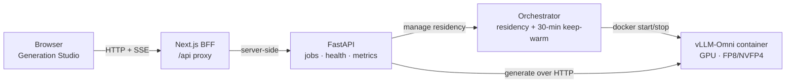

<p align="center">
  
</p>

<p align="center">
  <a href="LICENSE"></a>
  
  
  <a href="https://github.com/fengwang/Cosmos3-Nano-WebUI/actions/workflows/ci.yml"></a>
</p>

<h1 align="center">Cosmos3-Nano-WebUI</h1>

<p align="center">
  <b>Run a world model on your own GPU.</b><br>
  A self-hostable <b>API + Web UI</b> for Cosmos3-Nano quantized fp8 and nvfp4 checopoints:
  text/image&rarr;video (with audio), text&rarr;image, reasoning, and robot action, served locally.
</p>

## Quickstart

**TL;DR:** clone, grab a checkpoint, build, run. About five minutes plus the checkpoint download.

```bash
# 1. Clone
git clone https://github.com/fengwang/Cosmos3-Nano-WebUI.git
cd Cosmos3-Nano-WebUI

# 2. Download a pinned public checkpoint (ungated, no auth). FP8 shown; NVFP4 is analogous.
pip install "huggingface_hub[cli]"
hf download wfen/Cosmos3-Nano-FP8-Blockwise \
  --revision 9bf5d6ae164688487bdb71947ccc6ebe70d12900 \
  --local-dir ./models/Cosmos3-Nano-FP8-Blockwise

# 3. (Optional) configure. The defaults work for a local run.
cp .env.example .env      # edit only for LAN binding or a custom model path

# 4. Build the images (CPU) and bring up the FP8 stack
make build                # builds the api + webui images
make up-fp8               # webui :3000, api :8000, generation container

# 5. Check health, then open the Studio
make health               # GET /v1/health/ready
# → open http://localhost:3000  (you land directly in the Generation Studio)
```

No keys to set. A plain `make up-fp8` (or `make up-nvfp4`) brings up **all three modes**
off the quantized-only checkpoint — no BF16 base, no extra overlay. See them running in
[See it in action](#see-it-in-action), with the full per-mode status in
[Status & security](#status--security) and
[`docs/model_setup.md`](docs/model_setup.md).

<details>
<summary>Run the NVFP4 stack instead</summary>

- **NVFP4** (more VRAM headroom): download `wfen/Cosmos3-Nano-NVFP4-Blockwise` at
  its pinned revision (see [`docs/model_setup.md`](docs/model_setup.md)), then
  `make up-nvfp4`. Run one stack at a time. Note that NVFP4 needs a Blackwell-class GPU (RTX 5090 tested).
- Both stacks serve **all three modes** (Studio, Reasoning, Action) by default off the
  quantized checkpoint — there is no separate reasoning overlay or BF16 base to add.
</details>

**Jump to:** [What it does](#what-it-does) · [How it works](#how-it-works) ·
[Features](#features) · [See it in action](#see-it-in-action) ·
[Requirements](#requirements) · [Checkpoint setup](#checkpoint-setup) ·
[Troubleshooting](#troubleshooting) · [Status & security](#status--security)

## What it does

Cosmos3-Nano-WebUI wraps the Cosmos3-Nano world model behind a clean HTTP API and
a Next.js web app. You run generation, reasoning, and robot action on your own machine,
from public quantized checkpoints.

It targets a single RTX 5090-class GPU. Weights download from Hugging Face and are
never committed to Git or baked into images. The generation engine runs in its own
container. Open the web app and you land straight in the Generation Studio.

## See it in action

Three modes, one stack. Bring it up (`make up-fp8` or `make up-nvfp4`), open
`http://localhost:3000`, and try each — the full step-by-step with expected output and
screenshots is in **[`docs/walkthrough.md`](docs/walkthrough.md)**.

- **Studio — text&rarr;image.** Prompt *"a red apple on a wooden table, studio photo"*
  &rarr; a clean 480×480 studio-style image in the gallery. (Text&rarr;video,
  image&rarr;video, and video+audio work the same way, defaulting to 720p.)
- **Reasoning.** Ask a question in the **Reasoning** tab &rarr; a coherent answer streams
  back token by token.
- **Action (robots).** In the **Action** tab, pick an embodiment + mode and hit **Run
  demo** &rarr; a rolled-out video with a live **3D robot view** (agibotworld) or **2D
  trajectory plots** (av).

Every example runs on the quantized checkpoint you already downloaded.

NVFP4 checkpoint is recommended as it gives more VRAM headroom for longer videos, and with negligible quality differences, see:
- [FP8 video Examples](https://huggingface.co/wfen/Cosmos3-Nano-FP8-Blockwise/tree/main/assets/FP8-Examples), and
- [NVFP4 video Examples](https://huggingface.co/wfen/Cosmos3-Nano-NVFP4-Blockwise/tree/main/assets)

Below are two NVFP4 example videos, 720P and 7s.


https://github.com/user-attachments/assets/8ddc1fb4-b6d9-4aeb-8361-6519b812074d


## Requirements

- **Inference:** Linux with an NVIDIA GPU (RTX 5090-class) and current CUDA drivers.
- **Local stacks:** Docker + Docker Compose.
- **Disk:** several GB per checkpoint (weights are downloaded, not bundled).
- **Development (optional):** Python 3.12 (`>=3.12,<3.13`) + [`uv`](https://docs.astral.sh/uv/);
  Node 22 + [`pnpm`](https://pnpm.io/) 11. See [`CONTRIBUTING.md`](CONTRIBUTING.md).

## Checkpoint setup

Weights live in **public Hugging Face repositories** and are downloaded or mounted
by you. They are never committed to Git or baked into images. Pin the revision, not
the mutable `main`.

| Purpose | Repo id | Pinned revision | Model license |
|---|---|---|---|
| Generation — all modes (FP8) | `wfen/Cosmos3-Nano-FP8-Blockwise` | `9bf5d6ae1646…` | `openmdw-1.0` (OpenMDW 1.0) |
| Generation — all modes (NVFP4) | `wfen/Cosmos3-Nano-NVFP4-Blockwise` | `e59dcff2067d…` | `openmdw-1.0` (OpenMDW 1.0) |

A deployment serves exactly **one** of FP8 or NVFP4, and that single quantized checkpoint
serves **all three modes** — Studio, Reasoning, and Action — with no BF16 base. The compose
stacks wire the checkpoint mounts for you. [`docs/model_setup.md`](docs/model_setup.md) is the
source of truth for the pinned revisions and licenses (shown above as a snapshot), the exact
environment variables, the per-mode compatibility matrix, the mount layout, and drift caveats.

> **Licensing.** The repository **code is MIT** (see [`LICENSE`](LICENSE)). The
> **model weights are not MIT**: the FP8/NVFP4 checkpoints are **OpenMDW 1.0**
> (`openmdw-1.0`), and the legacy `nvidia/Cosmos3-Nano` base is **OpenMDW 1.1**.

## Troubleshooting

<details>
<summary>Common setup snags (click to expand)</summary>

- **Compose can't find your `.env`.** Compose's project directory is `deploy/`, so a
  repo-root `.env` is auto-passed only via `make` (`--env-file .env`). With a bare
  `docker compose -f deploy/…`, pass `--env-file .env` or place the file at
  `deploy/.env`.
- **Can't reach it from another machine.** Ports bind loopback by default. Set
  `BIND_ADDR=0.0.0.0` for LAN access, only on a trusted network.
- **One checkpoint at a time.** The FP8 and NVFP4 stacks share a fixed generation
  container name. Bring up one stack at a time (`make up-fp8` xor `make up-nvfp4`).
- **Cold start.** The API starts the generation container on demand; first requests
  wait on `COSMOS3_PLANE_READY_TIMEOUT` (default 30 min).
</details>

## Status

**Generation defaults & VRAM.**

- **Good output out of the box.** A curated negative prompt applies by default and is
  overridable per request and in the UI.
- **720p video default.** `1280×720` is the default for the video modes, served by
  the quantized **FP8/NVFP4** path (never the BF16 base). The shipped 49-frame default
  fits comfortably on 32 GB (measured peak ≈ 14.7 GB on FP8 with CPU offload, ≈ 18.5 GB on NVFP4).
  FP8's fit relies on layer-wise offload and tightens at higher frame counts, so
  prefer **NVFP4** for more headroom.
- **Stays warm for 30 minutes.** After a job finishes, the model stays resident so
  your next prompt runs right away. After 30 idle minutes the generation plane is
  evicted to free VRAM, and the next job cold-starts. Tune or disable this with
  `COSMOS3_IDLE_TIMEOUT_SECONDS` (default `1800` seconds; `0` never evicts). Holding
  VRAM for 30 minutes is intended on a single-user 5090, and a request for a
  different model still preempts immediately.

## How it works

A request flows from the browser to a GPU container and back. The API keeps the
model warm between jobs, so a normal watch-think-tweak loop does not pay a cold
reload each time.


```mermaid
flowchart LR
    B["Browser<br/>Generation Studio"] -->|HTTP + SSE| BFF["Next.js BFF<br/>/api proxy"]
    BFF -->|server-side| API["FastAPI<br/>jobs · health · metrics"]
    API -->|manage residency| ORCH["Orchestrator<br/>residency + 30-min keep-warm"]
    ORCH -->|docker start/stop| GEN["vLLM-Omni container<br/>GPU · FP8/NVFP4"]
    API -->|generate over HTTP| GEN
```

The API sends generation requests to the vLLM-Omni container over HTTP. The
orchestrator owns that container's lifecycle over the Docker socket: it starts the
container on demand and evicts it after an idle window to free VRAM (see
[Status & security](#status--security)).

## Features

Every generation, reasoning, and action mode is **implemented, CPU-tested, and
GPU-verified end to end on both FP8 and NVFP4**.

| Capability | Endpoint(s) | Status |
|---|---|---|
| Text&rarr;image (FP8, NVFP4) | `POST /v1/generation/t2i` | Implemented · **GPU-verified¹** |
| Text&rarr;video · image&rarr;video · video+audio | `POST /v1/generation/{t2v,i2v,t2v_audio}` | Implemented · **GPU-verified¹** |
| Reasoning | `POST /v1/reason` | Implemented · **GPU-verified¹** |
| Robot action / forward & inverse dynamics / policy | `POST /v1/action/{forward_dynamics,inverse_dynamics,policy}` | Implemented · **GPU-verified¹** |
| Async jobs + live progress over SSE | `POST /v1/jobs`, `GET /v1/jobs/{id}`, `.../events`, `.../artifact`, `.../trajectory`, `.../cancel` | Implemented · CPU-tested |
| Health & Prometheus metrics | `GET /v1/health/{live,ready}`, `GET /v1/metrics` | Implemented · CPU-tested |
| Web UI (generation, history, 3D / robot views) | Next.js 15 + React 19 app | Implemented · CPU-tested |

¹ **GPU-verified** = a recorded end-to-end run on an RTX 5090,
per mode and per format. All modes passed on **both FP8 and NVFP4**:
text&rarr;image, the video modes, reasoning, and robot action.
No performance numbers are promised.
See [Status & security](#status--security) and
[`docs/evidence_map.md`](docs/evidence_map.md).

## Project

- 🔒 **Security:** report vulnerabilities privately, see [`SECURITY.md`](SECURITY.md)
  (please do not open a public issue).
- 🤝 **Contributing & development:** [`CONTRIBUTING.md`](CONTRIBUTING.md) has the dev
  setup, the CPU checks that mirror CI, and the PR guidelines.
- 📜 **Code of Conduct:** [`CODE_OF_CONDUCT.md`](CODE_OF_CONDUCT.md).
- ⚖️ **License:** repo code is [MIT](LICENSE); model weights carry their own licenses
  (see [Checkpoint setup](#checkpoint-setup)).
